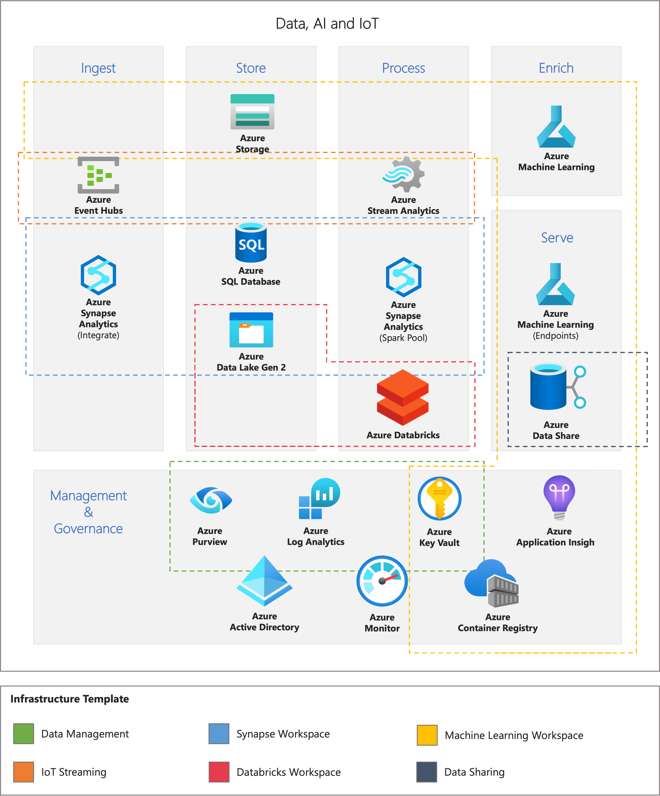

# Azure Infrastructure Templates

## Overview

This repository aims to accelerate the depoyment of common Data and AI workloads in Azure. It has been implemented through the use of Azure Bicep declarative infrastructure as code.

The services across each template address one or more different problems of data, AI and IoT use-cases - governance and management, ingestion, storage, processing, enrichment, serving. The following diagram illustrates the different services and the problems they address where each template has been outlined with a dashed box.

> Please note the templates in this repository are intended for proof-of-concept deployments. For a more production ready solution see: [Azure Analytics End to End with Azure Synapse - Deployment Accelerator](https://github.com/fabragaMS/AzureAnalyticsE2E)

## Deployment

### Deployment Types

Each template can be deployed in two modes: `poc` (which is the default) or `secure`.

| Deployment Mode   | Description |
|:------------------|:------------------|
| `poc` | Simple deployment configuration which is suitable for proof-of-concepts. Supported templates include: `data-management`, `data-synapse-workspace`, `data-databricks-workspace`, `data-azureml-workspace`, `iot-streaming`. |
| `secure` | Secure deployment configuration aligning with enterprise security requirements such as restricting user access, limiting network communication, applying data encryption, etc. Supported templates include: |

### Template Details

Each template aims to deploy infrastructure to address common cloud workloads.

| Template   | Description | Deploy to Azure |
|:---------------------------|:------------|:----------------|
| Data Management | Solution with services to manage and govern data assets across your organisation, monitor the logs and metrics of data services, securely store keys and secrets, and share data with third parties. | &nbsp; &nbsp; &nbsp; &nbsp; &nbsp; &nbsp; &nbsp; &nbsp;  &nbsp; &nbsp; &nbsp; &nbsp; &nbsp; &nbsp; &nbsp; &nbsp; |
| Synapse Workspace | Solution for an enterprise analytics service that accelerates time to insight across data warehouses and big data systems. |  |
| Databricks Workspace | Solution for a unified platform for data, analytics and artificial intelligence.|  |
| Machine Learning Workspace | Solution for accelerating and managing the development, deployment and monitoring of machine learning models. |  |
| IoT Streaming | Solution to ingest data streams generated by client applications or IoT devices and process data streams in real-time. |  |

More information regarding template deployment can be found [here](./.github/docs/template-deployment.md).

## License

Details on licensing for the project can be found in the [LICENSE](./LICENSE) file.
